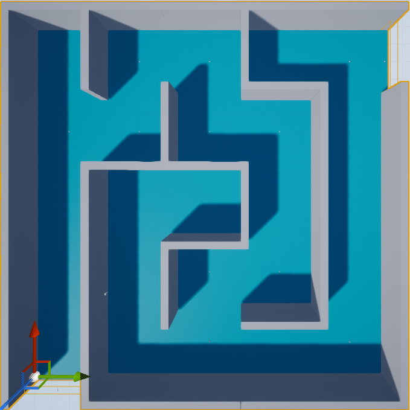
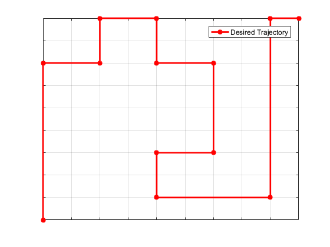
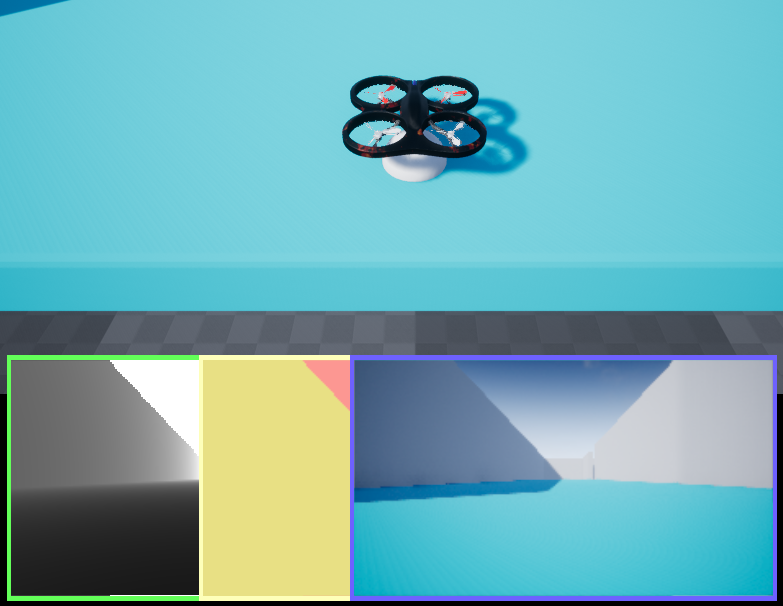

# AirsimSimulation

The simulation enviroument based on [Airsim](https://github.com/Microsoft/AirSim) 
is developed to verify the dynamic model and the designed control algorithm for quadrotor.
The quadrotor' motion is restrained in a narrow corridor, which represents a much more challenging workspace because any oscillation with the walls may cause the crash of the quadrotor vehicle.
The successive desired waypoints are specified on the critical corners of the maze map.

## Environment

* Windows 10
* Visual Studio 2015 Professional
* MATLAB 2016
* [Airsim V1.1.8](https://github.com/Microsoft/AirSim) 
* Unreal Engine 4.16

